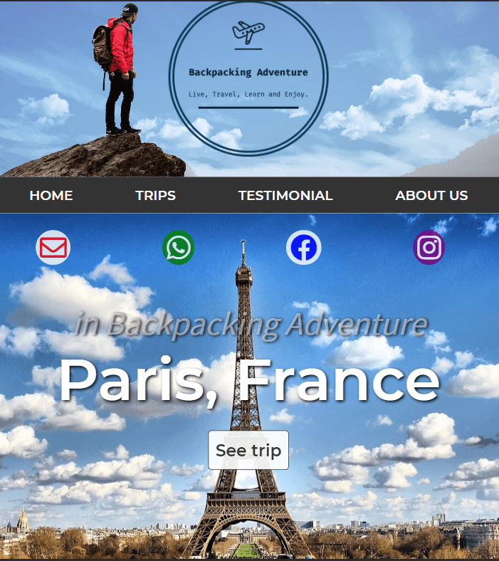

# Backpacking Adventure

### Mexico travel agency, which travels the best places in the country and the world.
> "Website", [demo here](http://localhost/).

#### Initialize the project
- Download or clone the project 
- Install dependencies
  - `$ npm install` 
- Run the project in development way with:
  - `$ npm run dev`
- > "Server runs at", [here](http://localhost:4000/).

#### Project details
- Javascript on the server side with Node.js
- Express as Framework of Node.js
- Template Engine: Pug.
- MVC Pattern to build this project.
- Deployed in heroku.
